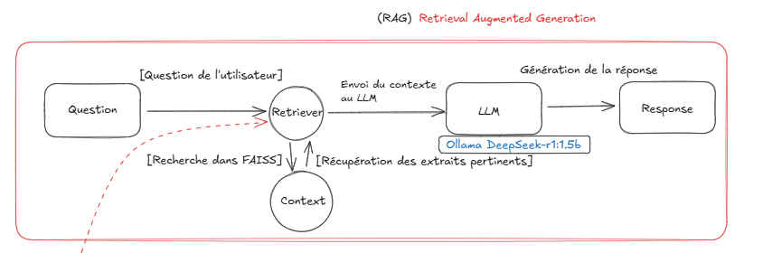
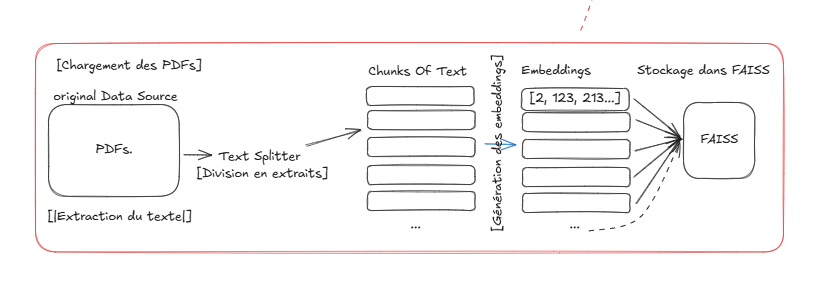
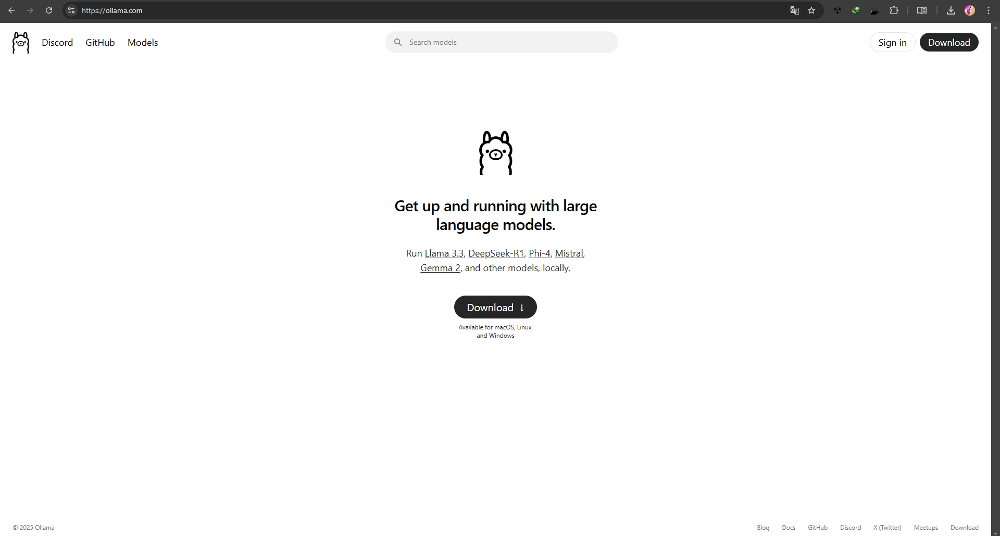
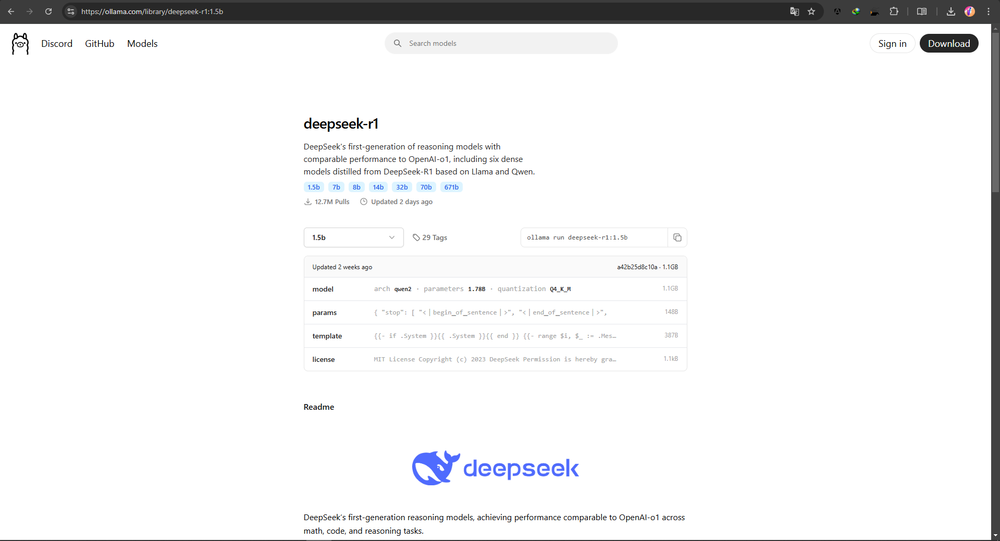
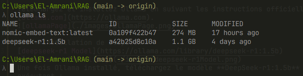
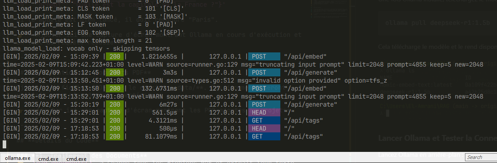
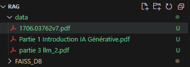
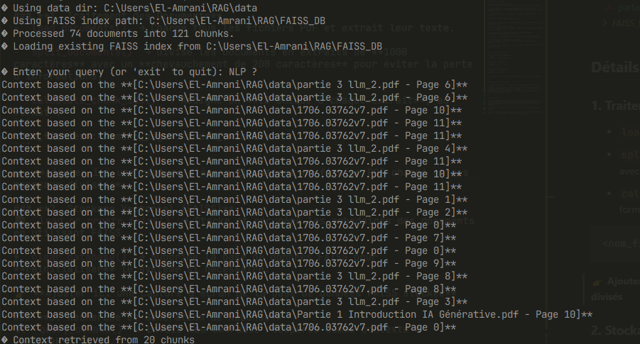
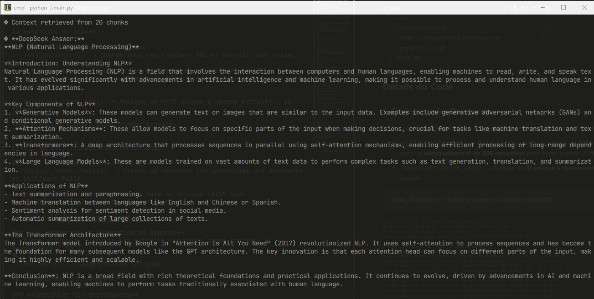

# **Système RAG Local utilisant Ollama (DeepSeek-r1:1.5b)**
`L-DAIA 2024-2025`

Made by:
- [@REp007(El-amrani Youssef)](https://github.com/REp007)

## **Table des matières**

1. [Technologies Utilisées](#technologies-utilisées)
2. [Qu'est-ce qu'un Système RAG ?](#qu'est-ce-qu'un-système-rag-retrieval-augmented-generation)
3. [Architecture du Système](#architecture-du-système)
4. [Installation et Configuration](#installation-et-configuration)
   - [Installation d'Ollama](#installation-dollama)
   - [Installation de DeepSeek](#installation-de-deepseek)
   - [Lancer Ollama et Tester la Connexion](#lancer-ollama-et-tester-la-connexion)
5. [Préparation des Documents PDF](#préparation-des-documents-pdf)
6. [Détails du Code](#détails-du-code)
7. [Exécution du Système](#exécution-du-système)


---

## **Technologies Utilisées**

| Technologie           | Description                                                                                                    |
| --------------------- | -------------------------------------------------------------------------------------------------------------- |
|  **Python**        | Utilisé pour développer le système RAG et gérer le traitement des fichiers et des requêtes.                    |
|  **LangChain**| Framework permettant de structurer l’utilisation des LLMs, la gestion des documents et des bases vectorielles. |
|  **FAISS**| Base de données optimisée pour stocker et rechercher des embeddings de documents de manière rapide.            |
|  **Ollama**| Serveur local permettant d’exécuter des modèles LLM comme DeepSeek-r1:1.5b sur `localhost:11434`.              |
|  **DeepSeek-r1:1.5b**| Modèle utilisé pour générer des réponses basées sur le contexte des documents récupérés.                       |

---

## **Qu'est-ce qu'un Système RAG (Retrieval-Augmented Generation) ?**

Un système **RAG (Retrieval-Augmented Generation)** combine la récupération d’informations dans une base de données avec un modèle de génération de texte. Cela permet d’améliorer la pertinence des réponses en s’appuyant sur des documents externes en plus des connaissances pré-entraînées du LLM.

### **Comment fonctionne ce système ?**

1. **Chargement et segmentation des documents** : Les fichiers PDF sont divisés en petits morceaux de texte (chunks) pour faciliter la récupération d’informations pertinentes.
2. **Indexation des documents** : Chaque chunk est converti en un vecteur (embedding) et stocké dans FAISS.
3. **Recherche des informations pertinentes** : Lorsqu’une question est posée, le système recherche les chunks les plus proches dans FAISS.
4. **Envoi du contexte au LLM** : Les extraits sélectionnés sont fournis comme contexte au modèle DeepSeek-r1:1.5b.
5. **Génération d’une réponse** : Le modèle répond en combinant les connaissances issues des documents et ses propres capacités de compréhension.

---

## **Architecture du Système**

**Illustration de l'architecture du système RAG :**




---

## **Installation et Configuration**

### **Installation d'Ollama**

Téléchargez et installez Ollama en suivant les instructions officielles sur [ollama.com](https://ollama.com).


### **Installation de DeepSeek**
[deepseek-r1 Model](https://ollama.com/library/deepseek-r1:1.5b)

Une fois Ollama installé, téléchargez le modèle **DeepSeek-r1:1.5b** en exécutant :
```bash
ollama pull deepseek-r1:1.5b
```
Cela télécharge le modèle et le rend disponible pour les requêtes locales.


### **Lancer Ollama et Tester la Connexion**

Lancez Ollama en arrière-plan :
```bash
ollama serve
```

Cela démarre le serveur local sur `localhost:11434`. Pour vérifier si le modèle fonctionne correctement, exécutez :
```bash
curl -X POST http://localhost:11434/api/generate -d '{"model": "deepseek-r1:1.5b", "prompt": "Quelle est la capitale de la France ?"}'
```
Si le modèle est bien lancé, il doit répondre "Paris".

---

## **Préparation des Documents PDF**

Ajoutez les fichiers PDF dans le dossier **data/**. Ces documents seront utilisés pour répondre aux questions.


---

## **Détails du Code**

### **1. Traitement des Documents**
- `load_documents()` → Charge tous les fichiers PDF et extrait leur texte.

- `split_documents()` → Divise les documents en extraits de **1000 caractères** avec un **chevauchement de 200 caractères** pour éviter la perte d’informations.

- `calculate_chunk_ids()` → Assigne un **ID unique à chaque extrait**, au format :
```
<nom_fichier>:<numéro_page>:<index_extrait>
```



### **2. Stockage Vectoriel (FAISS)**
- `load_or_create_faiss()` → Stocke et récupère les embeddings des documents en utilisant FAISS.

- `clear_database()` → Supprime la base de données FAISS pour **réinitialiser** le système si nécessaire.


### **3. Recherche et Génération de Réponse**
- `query_ollama()` → Envoie les extraits récupérés comme contexte à DeepSeek-r1:1.5b.



## **Exécution du Système**

### **Installer les dépendances**
```bash
pip install -r requirements.txt
```

### **Lancer le Système**
```bash
python main.py
```

### **Réinitialiser FAISS**
```bash
python main.py --reset
```
---

- MERCI - 

more info [Local-Rag Repo on Github](https://github.com/REp007/Local-RAG)
or Contact [@REp007](https://github.com/REp007)
